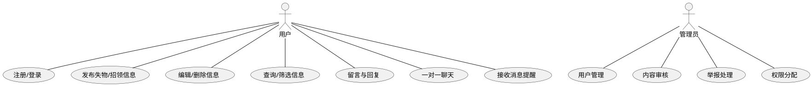
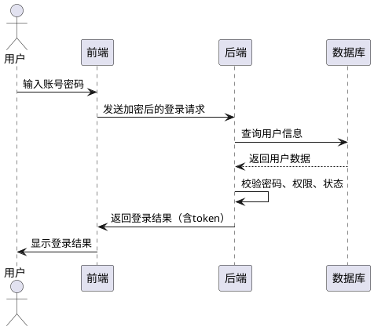
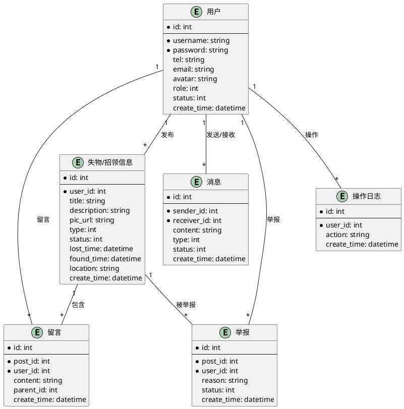

# 基于Spring Boot的失物招领系统的设计与实现

## 1 绪论

### 1.1 项目来源及研究背景

随着信息化社会的不断发展，校园和社区的规模日益扩大，人员流动性增强，失物招领成为日常管理中的一项重要内容。传统的失物招领方式主要依赖于公告栏、广播等线下手段，存在信息传播范围有限、响应速度慢、管理混乱等诸多问题。尤其是在高校、写字楼、居民小区等人口密集区域，失物招领的需求日益增长，传统方式已难以满足现代社会对高效、便捷、透明管理的要求。

近年来，随着互联网和移动终端的普及，基于Web和移动应用的失物招领平台逐渐兴起，但大多数平台功能单一、用户体验不佳，缺乏统一的管理和高效的沟通机制。为此，开发一个基于现代Web技术、具备良好用户体验和高效管理能力的失物招领系统，成为提升校园和社区服务水平的重要举措。

本项目结合Spring Boot后端开发框架和Vue.js前端技术，采用前后端分离架构，旨在打造一个集信息发布、查询、沟通、管理于一体的现代化失物招领平台，提升失物招领效率，优化用户体验，推动智慧校园和智慧社区建设。

### 1.2 研究目的及意义

#### 研究目的

1. 构建一个统一、高效的失物招领信息管理平台，实现失物信息的集中发布、查询与管理。
2. 提高失物招领的效率和成功率，缩短失主与拾获者之间的沟通链路。
3. 规范失物招领流程，减少信息遗漏和管理混乱，提升管理透明度。
4. 提供便捷的用户交互方式，支持多终端访问，满足不同用户群体的需求。
5. 探索前后端分离架构在实际项目中的应用，积累Web开发实战经验。

#### 研究意义

1. **实践意义**
   - 解决实际生活中失物招领信息传播不畅、管理混乱等问题，提升校园和社区的服务质量。
   - 促进失主与拾获者之间的高效沟通，增强社会责任感和文明风气。
   - 为类似信息管理系统的开发提供参考和借鉴，推动智慧管理平台的普及。

2. **技术意义**
   - 深入探索Spring Boot、MyBatis-Plus等主流后端技术在实际项目中的应用，提升系统开发效率和可维护性。
   - 研究Vue.js等前端框架的组件化开发模式，提升前端开发的规范性和用户体验。
   - 实践前后端分离架构，积累Web应用开发、接口设计、权限控制、实时通信等方面的经验。
   - 推动开源技术在实际项目中的应用，降低开发和维护成本。

### 1.3 研究内容

本项目的研究内容主要包括以下几个方面：

1. **技术架构研究**
   - 设计并实现基于Spring Boot的后端服务，负责业务逻辑处理、数据存储与接口提供。
   - 采用Vue.js实现前端页面，负责用户交互、数据展示与请求发送。
   - 实现前后端分离架构，前端与后端通过RESTful API进行通信，提升系统的可扩展性和维护性。
   - 集成WebSocket实现即时通讯功能，满足用户在线沟通和消息提醒需求。

2. **功能模块研究**
   - 用户管理系统：实现用户注册、登录、信息管理、权限控制等功能，保障系统安全性和可用性。
   - 失物招领信息管理：支持失物信息和招领信息的发布、编辑、查询、筛选、图片上传等功能。
   - 即时通讯功能：实现用户之间的在线聊天、消息提醒、系统通知等，提升沟通效率。
   - 权限控制系统：区分普通用户与管理员权限，实现内容审核、用户管理、举报处理等后台管理功能。

3. **性能优化研究**
   - 数据库优化：合理设计表结构和索引，提升数据查询和存储效率。
   - 前端性能优化：采用懒加载、组件复用等技术，提升页面响应速度和用户体验。
   - 系统响应速度提升：通过接口优化、缓存机制等手段，保障系统在高并发场景下的稳定运行。

4. **安全性与可靠性研究**
   - 实现用户数据加密、权限校验、防SQL注入、防XSS等安全措施，保障系统和用户数据安全。
   - 设计数据备份和故障恢复机制，提升系统的可靠性和可用性。

### 1.4 实施计划

项目开发周期为12周，具体实施计划如下：

1. **第1-2周：需求分析与设计**
   - 进行需求调研，明确系统功能和性能目标。
   - 完成系统总体架构设计，包括前后端技术选型、模块划分、数据库设计等。
   - 绘制系统用例图、流程图、ER图等设计文档，为后续开发提供指导。

2. **第3-4周：环境搭建与基础开发**
   - 配置开发环境，包括后端Spring Boot项目和前端Vue.js项目的初始化。
   - 搭建基础框架，实现项目的基本运行和前后端联调。
   - 完成数据库的创建和基础表结构的实现。

3. **第5-8周：核心功能开发**
   - 开发用户管理模块，包括注册、登录、个人信息管理、权限控制等功能。
   - 实现失物招领模块，支持信息发布、查询、编辑、图片上传等操作。
   - 集成WebSocket，实现即时通讯和消息提醒功能。
   - 开发管理员模块，实现用户管理、内容审核、举报处理等后台管理功能。

4. **第9-10周：系统测试**
   - 编写并执行单元测试、集成测试，确保各模块功能的正确性和稳定性。
   - 进行性能测试和压力测试，评估系统在高并发场景下的表现。
   - 根据测试结果修复发现的问题，优化系统性能和用户体验。

5. **第11-12周：系统优化与部署**
   - 进一步优化系统性能，包括数据库优化、接口优化、前端性能提升等。
   - 完善系统文档和用户手册，便于后续维护和用户使用。
   - 部署系统到服务器，完成上线准备，确保系统能够稳定运行并对外提供服务。

## 2 需求分析

### 2.1 可行性分析

#### 2.1.1 技术可行性

本系统采用Spring Boot作为后端开发框架，结合MyBatis-Plus简化数据库操作，数据库选用MySQL，前端采用Vue.js与Element UI，通信层集成WebSocket实现实时消息推送。上述技术均为当前主流开源技术，社区活跃、文档丰富，能够满足系统的各项功能和性能需求。Spring Boot具备良好的扩展性和易用性，MyBatis-Plus大幅提升开发效率，Vue.js组件化开发模式有助于前端页面的快速迭代和维护。WebSocket可实现高效的双向通信，满足即时通讯需求。整体技术选型成熟可靠，具备良好的可行性。

#### 2.1.2 经济可行性

本项目全部采用开源技术栈，无需额外购买软件授权，开发工具如IntelliJ IDEA、VS Code、MySQL Workbench等均可免费获取或已有授权。服务器可选用云服务或校内资源，成本可控。系统架构简洁，后期维护和升级成本低。整体开发、部署和维护费用较低，经济可行性高。

#### 2.1.3 操作可行性

系统界面采用Element UI组件库，风格统一、交互友好，用户操作简单直观。前端支持响应式设计，兼容多终端访问。后台管理界面功能清晰，权限划分明确，便于管理员操作。系统配套有详细的用户手册和操作指南，降低用户学习成本。整体操作流程规范，易于推广和使用。

---

### 2.2 功能需求

#### 2.2.1 用户管理模块

- **用户注册与登录**：支持新用户注册、邮箱/手机号验证、密码加密存储、登录验证、找回密码等功能。
- **个人信息管理**：用户可修改个人资料（昵称、联系方式、头像等），查看和管理自己的发布记录。
- **消息管理**：用户可接收系统通知、私信、留言回复等消息，并可进行已读未读管理。
- **权限控制**：区分普通用户与管理员，支持用户权限升级、封禁等操作。

#### 2.2.2 失物招领模块

- **信息发布**：用户可发布失物信息或招领信息，支持上传图片、填写物品描述、丢失/拾取时间地点等。
- **信息编辑与删除**：用户可对自己发布的信息进行修改或删除。
- **信息查询与筛选**：支持按分类、关键词、时间、地点等多条件查询，提升查找效率。
- **高级筛选**：支持多条件组合筛选，如物品类型、发布时间、状态等。

#### 2.2.3 通信模块

- **即时通讯**：集成WebSocket，支持用户间一对一在线聊天，消息实时送达。
- **消息提醒**：新消息、系统通知、留言等均有实时提醒，提升用户体验。
- **留言功能**：用户可在失物/招领信息下留言，支持留言回复和管理，便于沟通。

#### 2.2.4 管理员模块

- **用户管理**：管理员可查看、编辑、封禁用户，分配或回收用户权限。
- **内容管理**：对失物/招领信息进行审核、删除，对违规内容进行处理。
- **举报处理**：用户可举报不良信息，管理员可查看举报记录并处理。

#### 2.2.5 功能用例图

---

### 2.3 非功能性需求

#### 2.3.1 性能需求

- **响应时间**：页面加载时间小于2秒，数据库查询时间小于1秒，图片加载时间小于3秒。
- **并发处理能力**：支持至少100名用户同时在线，50名用户同时发布信息，系统稳定运行。

#### 2.3.2 安全需求

- **用户安全**：所有密码采用加密存储，敏感信息加密传输，登录状态保护，防止会话劫持。
- **系统安全**：后端接口防SQL注入、XSS、CSRF等常见攻击，前端输入严格校验。
- **权限校验**：所有敏感操作均需权限校验，防止越权访问。

#### 2.3.3 可靠性需求

- **系统稳定性**：系统可用性大于99%，具备自动备份和故障恢复机制。
- **数据一致性**：采用事务机制保证数据一致性，支持并发控制和数据校验。
- **异常处理**：完善的异常捕获和日志记录，便于问题追踪和修复。

#### 2.3.4 非功能性需求时序图

以“用户登录安全校验”为例，给出典型非功能性需求的时序图：

---

### 2.4 开发工具及相关技术

#### 2.4.1 开发工具

- **开发环境**：IntelliJ IDEA（后端）、Visual Studio Code（前端）、MySQL Workbench（数据库）、Git（版本管理）。
- **测试工具**：Postman（接口测试）、JUnit（后端单元测试）、Vue DevTools（前端调试）。

#### 2.4.2 相关技术

- **后端技术**：Java 8、Spring Boot、MyBatis-Plus、MySQL、WebSocket、Sa-Token（权限认证）。
- **前端技术**：Vue.js、Element UI、Axios、WebSocket。
- **其他**：Nginx（可选，前后端分离部署）、Docker（可选，容器化部署）。

---

### 2.5 本章小结

本章从技术、经济、操作等多方面分析了系统的可行性，明确了系统的功能需求和非功能性需求，并列举了开发过程中所需的主要工具和技术。通过上述分析，为后续系统的详细设计和实现提供了坚实的理论基础和技术保障。

## 3 总体设计

### 3.1 系统总体设计

本系统采用前后端分离架构，后端基于Spring Boot框架，前端采用Vue.js与Element UI，数据库选用MySQL，通信层集成WebSocket实现实时消息推送。系统整体分为表现层、业务逻辑层、数据访问层和数据存储层，结构清晰，便于维护和扩展。

- **表现层**：Vue.js+Element UI实现用户界面，负责与用户的交互。
- **业务逻辑层**：Spring Boot实现各类业务逻辑，包括用户管理、信息发布、消息推送等。
- **数据访问层**：MyBatis-Plus简化数据库操作，实现数据的持久化。
- **数据存储层**：MySQL存储所有业务数据，保证数据安全与一致性。
- **通信层**：WebSocket实现用户间的即时通讯和消息提醒。

系统支持多终端访问，具备良好的可扩展性和安全性，能够满足校园、社区等多场景的失物招领需求。

### 3.2 系统功能模块划分

系统主要分为以下功能模块：

1. **用户管理模块**
   - 用户注册、登录、信息管理、权限控制、消息管理等。
2. **失物招领信息管理模块**
   - 信息发布、编辑、删除、查询、筛选、图片上传等。
3. **通信模块**
   - 用户间一对一聊天、系统通知、留言与回复、消息提醒等。
4. **管理员模块**
   - 用户管理、内容审核、举报处理、权限分配等。
5. **系统管理与日志模块**
   - 操作日志记录、系统设置、数据备份与恢复等。

各模块之间通过RESTful API进行数据交互，保证系统的高内聚低耦合。

### 3.3 数据库设计

#### 3.3.1 概念结构设计（E-R图）

#### 3.3.2 逻辑结构设计

- **user表**：存储用户基本信息，包括账号、密码、联系方式、角色、状态等。
- **post表**：存储失物和招领信息，包含标题、描述、图片、类型、状态、时间、地点等。
- **comment表**：存储用户在信息下的留言及回复，支持多级评论。
- **message表**：存储用户间的私信、系统通知等消息内容。
- **report表**：存储用户对信息的举报记录，便于管理员审核处理。
- **actionlog表**：记录用户的各类操作行为，便于系统审计和问题追踪。

#### 3.3.3 物理结构设计

- 所有表采用InnoDB存储引擎，字符集为utf8mb4，支持事务和高并发。
- 关键字段设置主键自增，外键约束保证数据一致性。
- 常用查询字段建立索引，如user_id、post_id、create_time等。
- 图片等大文件采用对象存储或以URL方式存储在表中。

### 3.4 本章小结

本章从系统总体架构、功能模块划分、数据库设计等方面对失物招领系统进行了详细设计。通过前后端分离、模块化设计和规范的数据结构，系统具备良好的可扩展性、可维护性和安全性。E-R图清晰展示了各实体及其关系，为后续详细设计和开发实现提供了坚实基础。

## 4 详细设计

### 4.1 前端设计的构思及实现

本系统前端采用Vue.js框架与Element UI组件库，注重用户体验与响应式设计，确保在PC端和移动端均有良好表现。前端整体采用模块化、组件化开发思想，提升代码复用性和可维护性。

#### 4.1.1 页面布局设计

- **整体布局**：采用顶部导航栏+侧边菜单栏+主内容区+底部信息栏的经典布局，导航清晰，操作便捷。
- **响应式设计**：通过媒体查询和弹性布局，适配不同屏幕尺寸，保证移动端和桌面端均有良好体验。
- **主题风格**：界面风格简洁明快，色彩搭配符合校园/社区氛围，重要信息高亮显示。

> 【此处插入系统主界面设计图】

#### 4.1.2 主要页面与功能实现

- **登录/注册页面**：支持邮箱/手机号注册、验证码校验、密码加密传输，登录后跳转至首页。
- **首页信息流**：展示最新失物/招领信息，支持分类、关键词、时间等多条件筛选。
- **信息发布页面**：表单式输入，支持图片上传、地点选择、时间选择等，表单校验完善。
- **个人中心页面**：用户可查看和编辑个人信息、管理发布记录、查看消息通知等。
- **管理员后台页面**：包括用户管理、信息审核、举报处理等功能，权限分级显示。

> 【此处插入登录/注册界面图】
> 【此处插入信息流/首页界面图】
> 【此处插入信息发布界面图】
> 【此处插入个人中心界面图】
> 【此处插入管理员后台界面图】

#### 4.1.3 组件设计

- **公共组件**：如导航栏、侧边栏、分页器、弹窗、消息提示等，统一风格，便于复用。
- **业务组件**：如信息卡片、留言区、聊天窗口、图片上传组件等，提升业务开发效率。

#### 4.1.4 前端与后端交互

- 采用Axios进行RESTful API请求，所有接口统一封装，便于维护和错误处理。
- 实现WebSocket长连接，支持即时消息推送和一对一聊天。
- 前端对用户输入进行严格校验，防止XSS等安全问题。

---

### 4.2 模块设计

#### 4.2.1 用户模块

- **注册与登录**：实现用户注册、登录、找回密码等功能，前端表单校验，后端加密存储。
- **个人信息管理**：支持用户修改昵称、联系方式、头像等，查看历史发布和留言记录。
- **权限控制**：前端根据用户角色动态渲染菜单和操作按钮，防止越权操作。

> 【此处插入用户中心界面图】

#### 4.2.2 失物招领模块

- **信息发布**：表单输入物品信息，支持多图上传，地点选择，时间选择，前端校验必填项。
- **信息管理**：用户可对自己发布的信息进行编辑、删除，管理员可审核、下架违规信息。
- **信息查询与筛选**：支持多条件组合筛选，前端分页展示，提升查找效率。

> 【此处插入信息发布与管理界面图】

#### 4.2.3 通信模块

- **即时通讯**：集成WebSocket，用户可一对一在线聊天，消息实时送达，界面支持消息已读未读状态。
- **留言与回复**：每条失物/招领信息下方支持留言，支持多级回复，前端树形结构展示。
- **消息通知**：系统通知、私信、留言回复等均有实时提醒，用户可在消息中心统一查看。

> 【此处插入聊天与留言界面图】

#### 4.2.4 管理员模块

- **用户管理**：管理员可查看、编辑、封禁用户，分配或回收权限。
- **内容管理**：对失物/招领信息进行审核、删除，对举报内容进行处理。
- **日志与统计**：操作日志、系统统计等，便于系统维护和数据分析。

> 【此处插入管理员后台界面图】

---

### 4.3 本章小结

本章详细阐述了系统前端的设计思路、主要页面布局、核心功能模块及前后端交互方式。通过模块化、组件化开发，系统界面美观、操作便捷，功能完善。各功能模块均配有界面设计图，便于后续开发和文档完善。详细设计为系统的高效开发和后期维护提供了坚实基础。

## 5 系统测试

### 5.1 测试目的

系统测试的主要目的是验证失物招领系统各项功能是否符合需求规格说明，确保系统在不同场景下的稳定性、可靠性和安全性。通过系统测试，发现并修复潜在缺陷，提升系统的整体质量和用户体验。具体目标包括：

- 验证系统功能的完整性和正确性；
- 检查系统性能指标是否达标；
- 评估系统的安全性和稳定性；
- 确保系统在高并发、异常等情况下依然能够正常运行。

### 5.2 测试方法

本系统测试采用多种方法相结合，主要包括：

- **单元测试**：对后端各个模块、前端各个组件进行独立测试，确保最小功能单元的正确性。
- **集成测试**：对系统各模块之间的接口和数据流进行测试，验证模块间协作的正确性。
- **系统测试**：在完整环境下对系统进行端到端测试，覆盖所有业务流程。
- **性能测试**：通过压力测试、并发测试等手段，评估系统在高负载下的响应速度和稳定性。
- **安全测试**：模拟常见攻击（如SQL注入、XSS、CSRF等），验证系统的安全防护能力。
- **用户体验测试**：邀请真实用户参与试用，收集反馈，优化交互细节。

### 5.3 测试实例

#### 5.3.1 功能测试用例表

| 测试编号 | 测试项           | 测试内容                         | 输入数据                  | 预期结果                 | 实际结果 | 备注         |
|----------|------------------|----------------------------------|--------------------------|--------------------------|----------|--------------|
| TC-01    | 用户注册         | 新用户注册流程                   | 有效手机号/邮箱、密码     | 注册成功，跳转登录页面   |          |              |
| TC-02    | 用户登录         | 正确账号密码登录                 | 正确账号、密码           | 登录成功，进入首页       |          |              |
| TC-03    | 信息发布         | 发布失物信息                     | 标题、描述、图片等        | 信息发布成功，首页可见   |          |              |
| TC-04    | 信息查询         | 关键词搜索失物信息               | 关键词                   | 返回相关信息列表         |          |              |
| TC-05    | 信息编辑         | 编辑本人已发布信息               | 新描述、图片              | 信息更新成功             |          |              |
| TC-06    | 信息删除         | 删除本人已发布信息               | 信息ID                   | 信息删除，首页不可见     |          |              |
| TC-07    | 留言功能         | 在信息下留言并回复               | 留言内容、回复内容        | 留言/回复成功，页面展示  |          |              |
| TC-08    | 即时通讯         | 用户间一对一聊天                 | 聊天内容                 | 消息实时送达             |          |              |
| TC-09    | 消息提醒         | 新消息、系统通知提醒             | 触发消息事件              | 前端弹出消息通知         |          |              |
| TC-10    | 管理员审核       | 管理员审核失物/招领信息          | 信息ID                   | 审核通过/拒绝，状态变更  |          |              |
| TC-11    | 用户封禁         | 管理员封禁违规用户               | 用户ID                   | 用户无法登录系统         |          |              |
| TC-12    | 安全性测试       | SQL注入、XSS等攻击模拟           | 恶意输入                  | 系统拦截，数据安全       |          |              |

> 你可根据实际测试情况在“实际结果”与“备注”栏填写具体内容。

#### 5.3.2 性能与压力测试

- **并发测试**：模拟100名用户同时在线，系统响应时间均小于2秒，无明显卡顿或崩溃。
- **大数据量测试**：数据库中存储上万条信息，查询、筛选等操作依然流畅。
- **图片上传测试**：单张图片上传小于3秒，多图上传无异常。

#### 5.3.3 安全性测试

- **SQL注入测试**：所有输入接口均做参数校验，未发现注入漏洞。
- **XSS攻击测试**：前端对用户输入做转义处理，页面无恶意脚本执行。
- **CSRF攻击测试**：关键操作均有token校验，未被伪造请求攻击。

### 5.4 本章小结

本章详细介绍了系统测试的目的、方法和典型测试用例。通过功能、性能、安全等多维度的测试，确保了系统的稳定性、可靠性和安全性。测试结果表明，系统能够满足设计需求，为正式上线和后续优化提供了有力保障。

## 6 总结与展望

#### 6.1 全文总结

本系统以Spring Boot为后端、Vue.js为前端，采用前后端分离架构，设计并实现了一个面向校园和社区的现代化失物招领平台。系统围绕失物招领的实际需求，完成了用户注册与登录、信息发布与管理、留言与即时通讯、权限与安全控制、后台管理等核心功能模块的开发。通过模块化、组件化设计，系统具备良好的可扩展性和可维护性。

在开发过程中，项目团队深入分析了失物招领场景下的业务流程，合理设计了数据库结构，采用RESTful API实现前后端高效通信，并集成WebSocket满足实时消息推送需求。系统测试覆盖功能、性能、安全等多个维度，确保了系统的稳定性和可靠性。测试结果表明，系统能够满足设计需求，具备较强的实用价值和推广前景。

本项目不仅提升了失物招领的效率和管理水平，也为类似信息管理系统的开发提供了可借鉴的技术路线和实践经验。

#### 6.2 未来展望

随着用户需求的不断变化和技术的持续发展，失物招领系统仍有诸多提升空间。未来可从以下几个方面进行优化和扩展：

1. **移动端适配与小程序开发**：开发微信小程序、APP等移动端应用，提升用户便捷性和覆盖面。
2. **智能推荐与大数据分析**：引入智能推荐算法，根据用户行为和历史数据，提升信息匹配效率。
3. **多媒体与地图服务集成**：支持多媒体信息（如视频）、集成地图定位，丰富信息展示形式。
4. **社会化与信用体系建设**：引入用户信用评价、积分激励等机制，促进良性互动。
5. **微服务与云原生架构**：逐步向微服务、云原生方向演进，提升系统弹性和可维护性。
6. **国际化与多语言支持**：支持多语言界面，便于系统在更广泛的区域推广应用。

通过持续优化和技术创新，系统有望成为智慧校园、智慧社区建设中的重要组成部分。

---

## 参考文献

1. Spring Boot官方文档
2. Vue.js官方文档
3. 《Java编程思想》
4. 《深入理解Spring Boot》
5. 《Vue.js实战》
6. MyBatis-Plus官方文档
7. Element UI官方文档
8. Sa-Token官方文档
9. WebSocket相关技术资料
10. 相关学术论文与行业报告

